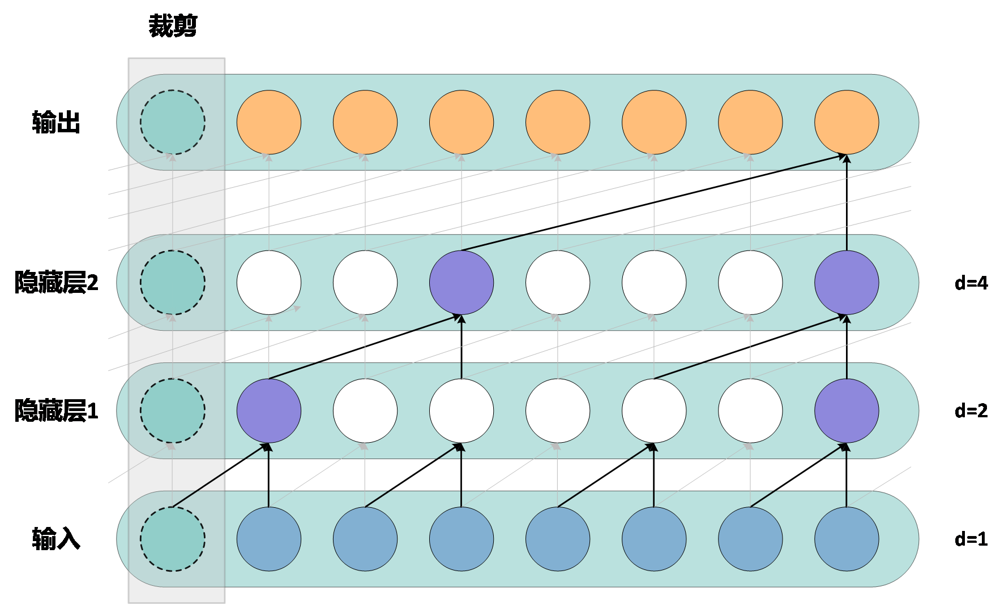
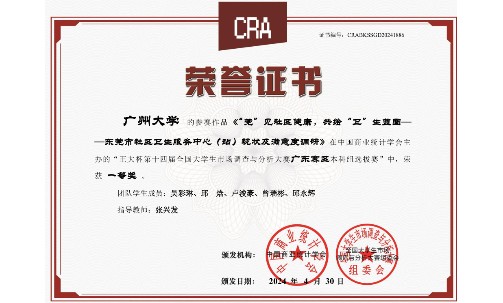

<!--
-->

## About Me

Hi everyone! I am **Junhao Lu (卢浚豪)**,, a student at the [School of Economics and Statistics, Guangzhou University](https://www.gzhu.edu.cn/), majoring in Statistics. I am fortunate to be supervised by [**Prof. Jianming Hu**](https://sms.hainanu.edu.cn/info/1571/5701.htm) and have been conducting interdisciplinary research on renewable energy and AI under his guidance. My research interests lie in novel energy systems, spatiotemporal forecasting, and deep learning.
I am actively seeking opportunities in related fields. If you find my background a good fit, please feel free to reach out to me!

[Email](jhlu25@outlook.com) / [Github](https://github.com/lujunhao123) / 

## My Interests
Currently, I primarily focus on the application and theoretical research of deep learning and machine learning in data mining. In terms of application, I am interested in fields such as large-scale wind-solar power generation systems and meteorological data processing. Theoretically, I focus on the effectiveness and theoretical guarantees of these machine learning methods. My goal is to leverage these advanced technologies to analyze various types of data and provide intelligent optimization and decision support across multiple industries. Below are some cutting-edge research topics I am interested in:

**1. Hierarchical Structure Recognition and Coordination in Large-Scale Data** In wind-solar power generation systems, we aim to develop a series of innovative neural network architectures and feature extraction techniques to achieve precise modeling. However, as the scale of wind-solar power generation systems increases, there are complex hierarchical (aggregated) relationships between large-scale wind farms, regional wind-solar farms, and wind-solar farm clusters. Ensuring that modeling methods adhere to hierarchical consistency is crucial for wind-solar integration. To address this challenge, we propose an efficient graph-based hierarchical coordination strategy.

**2. Application of Graph Neural Networks in Financial Fraud Detection** Financial fraud detection is an important task in the financial sector. Traditional machine learning methods usually focus on anomaly detection in individual transactions. However, as fraudulent techniques become more complex, these methods often fail to effectively identify multidimensional fraudulent behaviors. Graph Neural Networks (GNNs) offer significant advantages in this regard, as financial transactions often form a complex network involving multiple accounts, transactions, fund flows, etc. These pieces of information are interconnected in multi-layered and multidimensional ways.

**3. Statistical Theory of Change Point Detection in Deep Learning** Change point detection in time series or other data streams, which involves identifying distribution changes (i.e., change points), is of great importance. Traditional change point detection methods are based on statistical principles, such as maximum likelihood estimation and CUSUM (cumulative sum). However, with the development of deep learning techniques, researchers are exploring how to combine deep learning models with change point detection to enhance performance and overcome the limitations of traditional methods. But when applying new neural networks to change point detection, do they still provide theoretical guarantees? Are there limitations? Can we develop a change point detection network that comes with a theoretical guarantee?

## My Projects

### (1) American College Student Mathematical Modeling Contest

    <!-- Left side: Image -->
    

        
    

    

        
<strong>My team tackled complex mathematical modeling problems, including predicting Olympic medal outcomes and optimizing interval forecasting. We applied advanced statistical methods and machine learning techniques to improve prediction accuracy and balance the trade-off between coverage and interval predictions.</strong> <a href="../images/AAB/2523765.pdf" target="_blank" style="color: #0077b6; text-decoration: none;">Download the PDF to learn more</a>

    

### (2) National College Student Statistical Modeling Contest

    <!-- Left side: Image -->
    

        
    

    

    
<strong>Our team focused on mid-term multi-site collaborative weather forecasting. We proposed a BiLSTM model enhanced with a temporal convolutional attention mechanism (CBAM) to capture time-series dependencies and spatial correlations in weather data.</strong> <a href="../images/AAB/STA2024.pdf" target="_blank" style="color: #0077b6; text-decoration: none;">Download the PDF to learn more</a>
 
    
 

### (3) National College Student Market Research and Analysis Contest

 <!-- Left side: Image --> 
  
 
 
<strong>Our team focused on analyzing the development and satisfaction of community health services in Dongguan City. We utilized Python for text mining from social media platforms like Weibo, Zhihu, and Xiaohongshu to assess public sentiment. Additionally, we conducted surveys across multiple districts to identify factors influencing residents' choice of healthcare providers.</strong> <a href="../images/AAB/shidiao2024.pdf" target="_blank" style="color: #0077b6; text-decoration: none;">Download the PDF to learn more</a>
 
 

