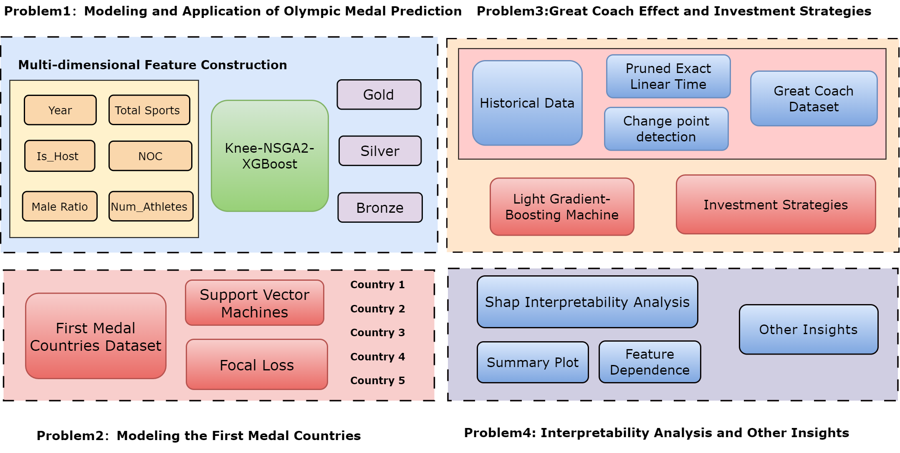

## About Me

Hi everyone! I am **Junhao Lu (卢浚豪)**,, a student at the [School of Economics and Statistics, Guangzhou University](https://www.gzhu.edu.cn/), majoring in Statistics. I am fortunate to be supervised by [**Prof. Jianming Hu**](https://sms.hainanu.edu.cn/info/1571/5701.htm) and have been conducting interdisciplinary research on renewable energy and AI under his guidance. My research interests lie in novel energy systems, spatiotemporal forecasting, and deep learning.
I am actively seeking opportunities in related fields. If you find my background a good fit, please feel free to reach out to me!

[Email](jhlu25@outlook.com) / [Github](https://github.com/lujunhao123) / 

## My Projects

    <!-- Left side: Image -->
    

        
    

    
<strong>My participation in the American College Student Mathematical Modeling Contest (MCM/ICM) involved my team, "O winner," with members Junhao Lu, Zhihao Zhong, and Xiaoling Chen.</strong>

    
In this competition, we addressed complex mathematical modeling problems, applying advanced optimization techniques and theoretical analysis to derive optimal solutions. Our work involved model construction, in-depth problem understanding, and results optimization, enhancing both our technical skills and collaborative efforts.

    
<strong>Have you ever wondered how AI can revolutionize energy systems?</strong>

    
Explore my research on integrating AI techniques to optimize energy system predictions and planning.

    <a href="your-pdf-link.pdf" target="_blank" style="color: #0077b6; text-decoration: none;">Download the PDF to learn more</a>

